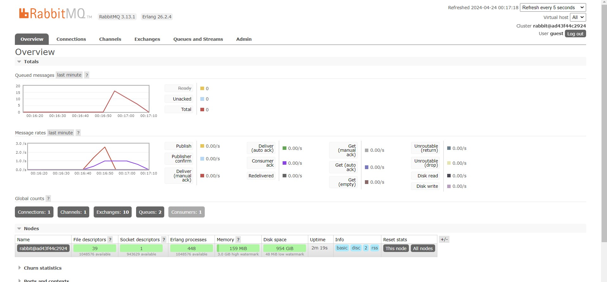

- Muhammad Faishal Adly Nelwan
- 2206030754/Advanced Programming C

# what is amqp?
*amqp* (Advanced Message Queuing Protocol) is a protocol used for passing messages between system applications. It ensures that data sent from one point reaches another through a middleware of message queues and rules for handling the messages, known as routing.

# what it means? guest:guest@localhost:5672 , what is the first quest, and what is the second guest, and what is localhost:5672 is for? 

1. First `guest`: This is the default username for the AMQP server
2. Second `guest`: This is the password associated with the username. Here again, `guest` is the default password often paired with the default `guest` username in default configurations.
3. `localhost`: This part of the string specifies the hostname or the IP address where the AMQP server is running. Because in this tutorial i am running it on the same machine as the client trying to connect, `localhost` specifically refers to the local machine.
4. `5672`: This is the port number on which the AMQP server is listening.

So, `guest:guest@localhost:5672` effectively tells the client software to log into the AMQP server running on the local machine using the default port 5672, with the username `guest` and the password `guest`. This connection string is used to establish a connection to the message broker for sending or receiving messages.

# Simulation slow subscriber using RabbitMQ

By executing `cargo run` 4 times the total queue was 16 with the running time in total of 20 seconds. Of course because i executed the `cargo run` sequentially, the total queue wouldn't be accurate/the same as everyone else due to human and computer delay. However i've found that the    `subscriber` experiences a delay in receiving or processing data from the message queue, with a delay of more or less a second for each process.

